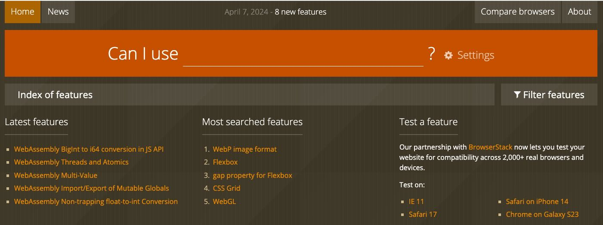

## Overview

Developers often need to choose the right Arm platform for an application, but device availability, operating system coverage, and architecture feature support can be hard to compare quickly. A challenge page gives you a place to explore an open-ended problem and build something useful for the Arm software community.

In this challenge, you design a dashboard, like the one above, that shows how widely Arm architecture features are supported across devices, platforms, and software stacks. Think of it as an Arm-focused equivalent of a compatibility explorer such as Can I Use, but targeted at software developers who need to understand architecture support and optimization opportunities.

## The challenge

Create a dashboard that helps developers answer questions such as:

- Which Arm architecture features are popular across smartphones, laptops, and cloud instances?
- How does operating system coverage change over time for a given Arm CPU extension?
- Which software libraries and tools support a specific feature on a specific platform?
- Which combinations still need validation, optimization, or documentation?

Your implementation can use any language or framework. A web-based solution is a good fit because it lets you combine data collection, search, filtering, and visualization in one place.

## Suggested scope

Start with a small, useful slice of the problem. For example, you can:

- Track adoption of SVE2, SME2, or Neon across a curated set of devices
- Compare Windows on Arm, Linux on Arm, and Android support for selected software packages
- Build a searchable index for libraries such as FFmpeg and show whether they expose Arm-specific acceleration paths
- Visualize changes over time with charts or heatmaps

## Skills you can practice

This challenge is a good fit if you want to improve in one or more of these areas:

- Data collection and normalization
- Web development and dashboard design
- Statistical analysis and visualization
- Arm software ecosystem research
- API integration and data modeling

## Assessment criteria

Submissions are assessed using broad criteria that reflect the usefulness of the dashboard, the quality of the data, and its value to developers working on Arm.


    
Your submission should help developers answer practical questions about Arm technologies, platforms, and software support. Strong entries focus on information that is useful for real development, migration, optimization, or validation decisions.
    
    
Assessors look for dashboards that do more than display raw data. Strong submissions organize information clearly, highlight meaningful patterns, and make it easier to spot gaps, trends, or opportunities in the Arm software ecosystem.
    
    
Your implementation should be clear, responsive, and easy to navigate. Strong entries provide effective filtering, search, or visualization choices and present the data in a way that helps users reach answers quickly.
    
    
Your project should explain where the data comes from, how it is updated, and how others can run or extend the dashboard. Clear documentation and reproducible data-handling steps help reviewers assess both the quality and sustainability of the work.
    


## Prepare your approach

You can choose your own implementation approach. These skills are helpful:

- Intermediate experience with Python, JavaScript, or another object-oriented language
- Basic understanding of data structures and APIs
- Access to a development system with internet connectivity

## Resources

- [Arm Software Ecosystem Dashboard](https://www.arm.com/developer-hub/ecosystem-dashboard)
- [Windows on Arm support wiki](https://linaro.atlassian.net/wiki/spaces/WOAR/overview)
- [Can I Use](https://caniuse.com/)

## What to deliver

Aim to produce a working prototype that includes:

- A clear data model for platforms, operating systems, and Arm features
- At least one searchable or filterable view
- At least one chart, table, or heatmap that highlights feature support
- A short explanation of your data sources and update strategy
