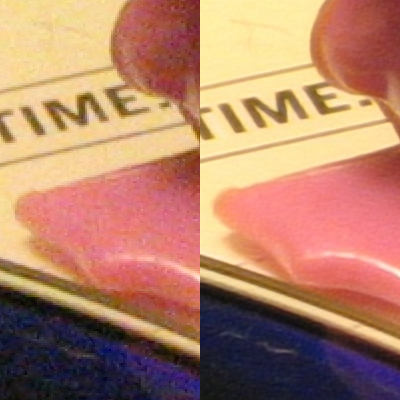

## 🗺️ Overview

Modern camera experiences such as night mode, portrait effects, and extreme zoom increasingly depend on neural networks. With Arm SME2 and related acceleration features becoming available in commercial devices, more of these workloads can run efficiently on Arm CPUs and GPUs.

In this challenge, you design and implement a novel computational photography pipeline optimized for an Arm-based device. Your solution should focus on both image quality and execution efficiency.

## 🚀 Mission brief

Design and implement one of the following computational photography pipelines, or a closely related variant, on an Arm-based system:

- Night-mode imaging to improve low-light signal-to-noise ratio
- Portrait-mode imaging with realistic bokeh blur
- Neural ray denoising for rendering-related image data
- Generative AI pipelines such as style transfer or diffusion-based enhancement

## 🎯 Suggested scope

Your project should aim to optimize both inference latency and perceived image quality. The technical criteria include:

- Use a quantized neural network, preferably below 16-bit precision
- Preferably use the ExecuTorch runtime with Arm Neural Technology and the ML extensions for Vulkan backend
- Run on an Arm-based CPU with SIMD support such as SVE or SME, or on a Neural Graphics capable GPU

## 💡 Skills you can practice

- Computational photography design
- Neural inference optimization
- SIMD and GPU-aware implementation on Arm
- Image quality evaluation

## ✅ Assessment criteria

Submissions are assessed using broad criteria that balance image quality, technical execution, and effective use of Arm platforms.


    
Your submission should make meaningful use of Arm-based compute features such as SIMD, SME, SVE, Vulkan acceleration, or Arm-oriented runtimes. Strong entries explain how the implementation takes advantage of Arm hardware rather than treating Arm as only a target device.
    
    
Assessors look for a convincing balance between visual quality and runtime efficiency. Strong submissions demonstrate thoughtful trade-offs in latency, memory use, precision, and output quality for the selected photography task.
    
    
Your project should show considered technical design, whether through model architecture, pipeline structure, optimization strategy, or evaluation method. Strong entries present a distinctive approach or a clearly justified improvement over a simpler baseline.
    
    
Your work should be clear enough for others to understand and test. Strong submissions provide setup instructions, model details, evaluation steps, and enough context for reviewers to reproduce both performance and quality claims.
    


## 🔧 Prepare your approach

These skills and resources are helpful before you begin:

- Experience with image processing algorithms such as convolution and filtering
- Intermediate experience, or willingness to learn, machine learning for graphics and photography
- Familiarity with CMake, Docker, C++, Python, and Vulkan
- An interest in low-level optimization on Arm devices

## 📚 Resources

- Blog: [Neural camera denoising with Arm SME2](https://developer.arm.com/community/arm-community-blogs/b/ai-blog/posts/unlocking-the-power-of-neural-camera-denoising-with-arm-sme2)
- Software: [Reference AI camera pipelines](https://gitlab.arm.com/kleidi/kleidi-examples/ai-camera-pipelines)
- Blog: [Neural Graphics](https://developer.arm.com/mobile-graphics-and-gaming/neural-graphics)
- Software: [Arm KleidiCV](https://gitlab.arm.com/kleidi/kleidicv)
- Software: [vkdt open source photography workflow](https://github.com/hanatos/vkdt)
- Tutorial: [Minimal Arm VGF backend demonstration](https://github.com/pytorch/executorch/blob/main/examples/arm/vgf_minimal_example.ipynb)

If you need help with hardware access for this project, contact Arm-Developer-Labs@arm.com.
